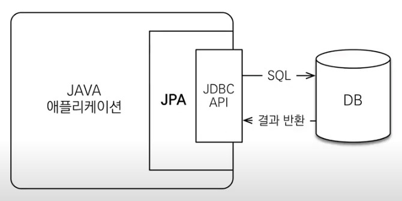

## Chap 02. Maria 데이터베이스와 Spring Data JPA
### 2-3 Spring Data JPA 소개  
[`Spring-Data-Examples`](https://github.com/spring-projects/spring-data-examples/tree/main/jpa)  
[`Docs`](https://spring.io/projects/spring-data-jpa)  
+ ## ORM(Object Relational Mapping)이란?  
__`'객체 - 관계형 데이터베이스를 매핑하는 프로그래밍 기법'`__  
객체가 관계형 데이터 베이스의 테이블이 되도록 매핑 시켜주는 것이다.  

__왜 객체와 관계형 데이터베이스 간의 매핑을 지원해주는 Framework나 Tool들이 나오는 것일까?__  
ORM framework나 도구가 없던 시절에도 이미 우리는 OOP를 하면서 객체와 관계형 데이터베이스를 모두 잘 사용하고 있었음에도 불구하고, 굳이 이런 새로운 개념들이 나오게 되는 이유는 <u>"Back to basics(기본에 충실하자)"</u> 을 지키기 위해서라고 볼 수 있다. 즉, 보다 OOP(Object_Oriented Programming)다운 프로그래밍을 하자는데부터 출발한 것이다.

그럼 과연 무엇이 문제였던 것일까? 우리가 어떤 어플리케이션을 만든다고 하면 관련된 정보들을 객체에 담아 보관하게 된다. 객체와 그와 연결된 객체들을 데이터베이스의 테이블에 저장 한다는 것이다. 즉, 테이블(Table)에 객체가 가지고 있던 정보를 입력하고, 이 테이블들을 "join"과 같은 SQL 질의어를 통해 관계 설정을 해 주게 된다. 여기서 문제는 이 테이블과 객체간의 이질성이 발생 하게 된다는 것이다.

이 객체간의 관계를 바탕으로 SQL을 자동 생성하여 아질성을 해결하는 것이 ORM이다.
ORM을 이용하면 SQL Query가 아닌 직관적인 코드(메서드)로서 DB의 데이터를 조작 가능하다.

##### 객체 지향 언어별로 이 ORM 사용을 사용하고 있다.
>- Django : ORM cookbook
>- Node.js : Sequalize
>- Java : Hibernate, JPA  


### __`사용예시 ex)`__
보통 ORM Framwork들은 이러한 이질성을 해결하기 위해서 객체와 테이블간의 관계를 설정하여 자동으로 처리하게 되는데 예시를 통해 확인하면 다음과 같다.
``` java
public class Person{
    private String name;
    private String height;
    private String weight;
    private String ssn;
    //implement getter & setter methods
}
```
iBatis(MyBatis)의 경우에는 다음과 같이 mapping file내에서 해당 query의 결과를 받을 객체를 지정해 줄 수 있다
``` java
// iBatis
<select id="getPerson" resultClass="net.agilejava.person.domain.Person">
    SELECT name, height, weight, ssn FROM USER WHERE name = #name#;
</select>
```
즉, getPerson 이라고 정의된 질의어 결과는 net.agilejava.person.domain의 Person객체에 자동으로 mapping 되는 것이다. Hibernate의 경우에는 mapping 파일에서 다음과 같이 표현을 해준다.
``` java
// Hibernate
<hibernate-mapping>
    <class name="net.agilejava.person.domain.Person" table="person">
        <id name="name" column="name"/>
        <property name="height" column="height"/>
        <property name="weight" column="weight"/>
        <property name="ssn" column="ssn"/>
    <class>
</hibernate-mapping>
```

>### `ORM의 장점`
>> 1. 객체 지향적인 코드로 인해 더 직관적이고 비즈니스 로직에 더 집중할 수 있게 도와준다.
>> 1. 선언문,ㅔ 할당, 종료 같은 부수적인 코드가 없거나 급격히 줄어든다.
>> 1. 각종 객체에 대한 코드를 별도로 작성하기 때문에 코드의 가독성을 올려준다.
>> 1. SQL의 절차적이고 순차적인 접근이 아닌 객체 지향적인 접근으로 인해 생산성이 증가한다.
>> 1. 재사용 및 유지보수의 편리성이 증가한다.
>> 1. ORM은 독립적으로 작성되어있고, 해당 객체들을 재활용 할 수 있다.
>> 1. 때문에 모델에서 가공된 데이터를 컨트롤러에 의해 뷰와 합쳐지는 형태로 디자인 패턴을 견고하게 다지는데 유리하다.
>> 1. 매핑정보가 명확하여, ERD를 보는 것에 대한 의존도를 낮출 수 있다.
>> 1. DBMS에 대한 종속성이 줄어든다.
>> 1. 대부분 ORM 솔루션은 DB에 종속적이지 않다.
>> 1. 종속적이지 않다는것은 구현 방법 뿐만아니라 많은 솔루션에서 자료형 타입까지 유효하다.
>> 1. 프로그래머는 Object에 집중함으로 극단적으로 DBMS를 교체하는 거대한 작업에도 비교적 적은 리스크와 시간이 소요된다.
>> 1. 또한 자바에서 가공할경우 equals, hashCode의 오버라이드 같은 자바의 기능을 이용할 수 있고, 간결하고 빠른 가공이 가능하다.

> ### `ORM의 단점`
>> 1. 완벽한 ORM 으로만 서비스를 구현하기가 어렵다.
>> 1. 사용하기는 편하지만 설계는 매우 신중하게 해야한다.
>> 1. 프로젝트의 복잡성이 커질경우 난이도 또한 올라갈 수 있다.
>> 1. 잘못 구현된 경우에 속도 저하 및 심각할 경우 일관성이 무너지는 문제점이 생길 수 있다.
>> 1. 일부 자주 사용되는 대형 쿼리는 속도를 위해 SP를 쓰는등 별도의 튜닝이 필요한 경우가 있다.
>> 1. DBMS의 고유 기능을 이용하기 어렵다. (하지만 이건 단점으로만 볼 수 없다 : 특정 DBMS의 고유기능을 이용하면 이식성이 저하된다.)
>> 1. 프로시저가 많은 시스템에선 ORM의 객체 지향적인 장점을 활용하기 어렵다.
>> 1. 이미 프로시저가 많은 시스템에선 다시 객체로 바꿔야하며, 그 과정에서 생산성 저하나 리스크가 많이 발생할 수 있다.

+ ## JPA란?
`'Java Persistence API'의 약어로 ORM을 Java 언어에 맞게 사용하는 '스펙'이다.`


자바 어플리케이션에서 관계형 데이터베이스를 사용하는 방식을 정의한 __인터페이스__ 이다.
### __JPA는 인터페이스다? => 구현체가 필요하다!!__
ORM은 객체를 매핑, SQL Mapper는 쿼리를 매핑
__왜? JPA를 사용해야 하는가?__
> 1. SQL 중심적인 개발에서 객체 중심으로 개발
>   -> 부모-자식 관계표현 / 1:N 관계표현 / 객체지향 프로그래밍을 쉽게 할 수 있다
> 1. 생산성
> 1. 유지보수
> 1. 패러다임의 불일치 해결
> 1. 네이티브 쿼리만큼의 성능을 낼 수 있다.
> 1. 데이터 접근 추상화와 벤더 독립성
> 1. 표준
> 1. 직접 CRUD 쿼리를 작성할 필요가 없음

+ ## Spring Data JPA
`하이버네이트와 같은 구현체를 좀 더 쉽게 사용하고자 추상화 시킨 모듈`


#### Spring Data JPA 를 쓰는 이유는?
1. 구현체 교체의 용이성
    + 대표적인 구현체인 Hibernate가 수명이 다했다고 가정을 하게 된다면, 다른 새로운 구현체로 쉽게 교체가 가능하다. -> Spring Data JPA내부에서 구현체 매핑을 지원해 줌
2. 저장소 교체의 용이성
    + 관계형 데이터베이스 외에 다른 저장소로 쉽게 교체 가능하다! 
        -> 의존성만 교체하면 된다.
